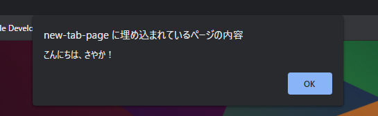

### コンソールとアラートに文字を表示する
*JavaScript*  
2021.5.10

---

JavaScriptの基本のきですが、つまづかないようにやっていきたいと思います!


### コンソールに表示する
**コンソール**は、ブラウザの開発ツールにあるコマンドラインツールで、**警告を表示**したり、**デバッグ**（プログラムのエラーを修正すること）で値を表示させたりすることができます。Windowsのコマンドプロンプトと似ています。

コンソール(consle)画面は、ブラウザの開発者ツールをメニューから開いて確認します。
入力カーソルがあるところです。

コンソールに文字を出力するには、`console.log('表示したい文字')`  
と入力して、エンターを押します。すると`〇〇`の文字が表示されます。また、JavaScriptのプログラム内に書いておくと、同じようにコンソールに内容が表示されます。

はじめて文字を出力させるときは、プログラミングの伝統的には`Hello,World!`ですが、なんでもいいのでやってみましょう。Cromeだと下のようになると思います。

```
> console.log('こんにちは、さやか！')
  こんにちは、さやか！
```

なお、`console.log('表示したい文字')`の文字を囲む記号（クオテーションマーク）は、"と'のどちらでも大丈夫です。でも、ふだんどちらを使うか統一しといたほうがいいです。

### アラートに文字を表示する
今度は、ブラウザの警告のときなどに出る、アラート画面に文字を表示させてみます。コンソール画面で、`alert('表示させたい文字')`と入力します。すると、ブラウザの画面でポップアップが表示されます。



コンソールとアラートは、デバッグで値を確認するときに使うと便利です。


---
[Topに戻る](../index.html)